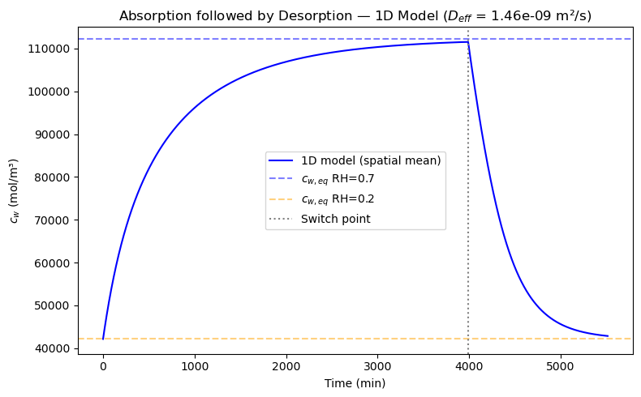
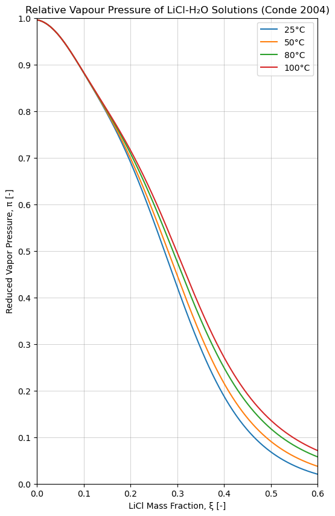
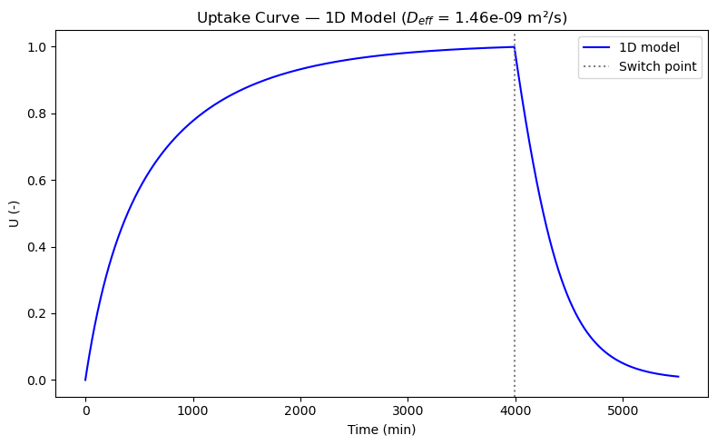
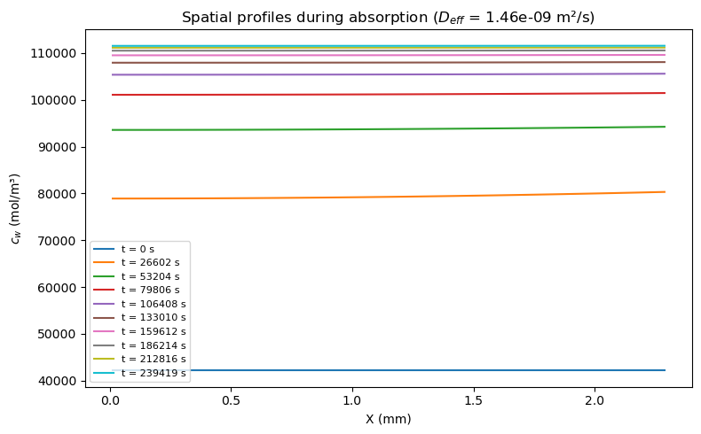

# 1D Water Sorption Model for a LiCl–PAM Hygroscopic Hydrogel

A 1D diffusion model, written from scratch in Python, of water absorption and desorption in a slab of LiCl-loaded polyacrylamide (PAM) hydrogel. The model reproduces the sorption/desorption results of Díaz-Marín et al. (2024) and provides a reusable workflow for screening hydrogel designs: change the thickness, mass-transfer coefficient, diffusivity, salt loading or humidity step, and read off the uptake curve and its time constants.

This is a semester project from the MSc in Mechanical Engineering at EPFL (2025–2026), *"Modeling Moisture Sorption and Desorption Kinetics of Diffusion-Limited Hygroscopic Hydrogels"*.

**Author:** Max Dittmann  
**Supervisor:** Gautier R.



## What the model does

The unknown is the local water concentration $c_w^{ref}(X,t)$ in the dry reference frame of a slab of dry thickness $H_d$. Water moves by Fickian diffusion through the polymer network, the salt is immobile, and exchange with the air happens only at the exposed top surface. The bottom is an impermeable substrate.

$$\frac{\partial c_w^{ref}}{\partial t} = \frac{\partial}{\partial X}\left(D_{eff}\frac{\partial c_w^{ref}}{\partial X}\right)$$

Boundary conditions:

- **Bottom** ($X=0$): zero flux, $\partial c_w^{ref}/\partial X = 0$.
- **Top** ($X=H_d$): surface mass transfer (Robin condition), where $a_w$ is the water activity of the gel at the surface and $RH_\infty$ the ambient humidity:

$$D_{eff}\frac{\partial c_w^{ref}}{\partial X}\bigg|_{X=H_d} = h_m\frac{P_{sat}}{RT}\left[a_w(c_w^{ref},T) - RH_\infty\right]$$

The water activity $a_w(c_w, T)$ comes from the Conde (2004) correlation for LiCl–water solutions, which gives the equilibrium between gel composition and humidity. The equilibrium concentrations at the two humidities are found with Brent's method.



## Numerical implementation

- Cell-centred grid with $N=100$ cells and a time step of 1 s.
- Implicit (backward Euler) diffusion step. The tridiagonal matrix is constant, so it is assembled once.
- Zero-flux and Robin boundaries are enforced with ghost nodes (derivation in the notebook).
- The nonlinear surface flux is evaluated at the previous time step (explicit), which keeps the matrix linear at the cost of an $\mathcal{O}(\Delta t)$ splitting error at the boundary.
- Each phase runs until the spatial-mean concentration has covered 99% of the step between the two equilibrium concentrations.

## Results

Simulation of a 2.3 mm slab at 25 °C, first absorbing at $RH = 0.7$ and then desorbing at $RH = 0.2$, starting from equilibrium at $RH = 0.2$:

| Quantity | Value |
|---|---|
| Dry thickness $H_d$ | 2.3 mm |
| Mass transfer coefficient $h_m$ | 9.5 × 10⁻³ m/s |
| Effective diffusivity $D_{eff}$ | 1.464 × 10⁻⁹ m²/s |
| Modified Biot number $Bi$ | 0.024 |
| Equilibrium $c_w$ at $RH = 0.2$ / $0.7$ | 42 161 / 112 242 mol/m³ |
| Time to 99% of the absorption step | 3 990 min |
| Time to 99% of the desorption step | 1 525 min |
| Fitted time constant, absorption $\tau_{abs}$ | 641 min |
| Fitted time constant, desorption $\tau_{des}$ | 366 min |

The time constants come from fitting $U_\infty(1-e^{-t/\tau})$ to absorption and $U_\infty e^{-t/\tau}$ to desorption. Uptake $U$ is the mass of absorbed water per mass of gel at the $RH = 0.2$ state, and reaches about 1 g/g.



With $Bi = 0.024$, concentration gradients across the slab stay small, so uptake is limited mainly by surface mass transfer rather than by diffusion inside the gel:



### Validation

The model was checked against the numbers reported in Díaz-Marín et al. (2024) and reproduces their sorption/desorption results with good agreement.

## Running it

```bash
git clone <this repository>
cd <repository folder>
pip install -r requirements.txt
jupyter notebook 1D_final1.ipynb
```

Then run all cells. A full run (about 330 000 time steps) took about 40 seconds on a 2-core test machine and needed roughly 0.6 GB of RAM, because the full concentration history is kept in memory. The last cell writes a downsampled results file to `results/`. If Jupyter cannot find the kernel stored in the notebook, choose your Python 3 kernel via *Kernel → Change kernel*.

Dependencies: NumPy, SciPy, Matplotlib and Jupyter.

## Assumptions and limitations

- Isothermal (constant temperature) and 1D.
- Constant effective diffusivity; salt does not move.
- Explicit treatment of the nonlinear surface flux (first-order splitting error, see above).

## References

1. C. D. Díaz-Marín, L. Masetti, M. A. Roper, K. E. Hector, Y. Zhong, Z. Lu, O. R. Caylan, G. Graeber, J. C. Grossman. *Physics-based prediction of moisture-capture properties of hydrogels.* Nature Communications 15, 8948 (2024). https://doi.org/10.1038/s41467-024-53291-5
2. M. R. Conde. *Properties of aqueous solutions of lithium and calcium chlorides: formulations for use in air conditioning equipment design.* International Journal of Thermal Sciences (2004). https://www.sciencedirect.com/science/article/abs/pii/S1290072903001625
